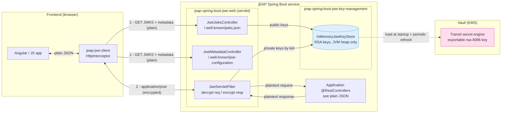
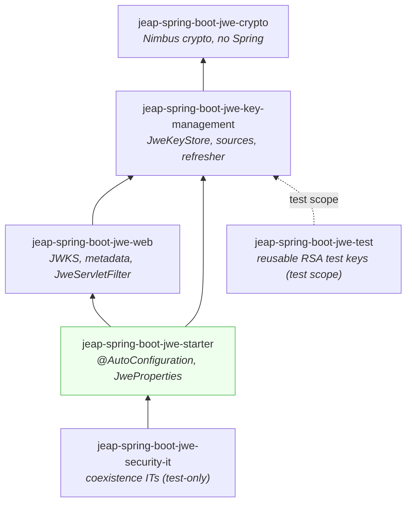
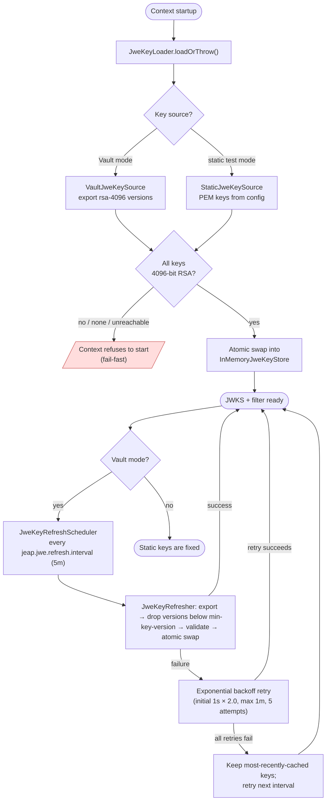
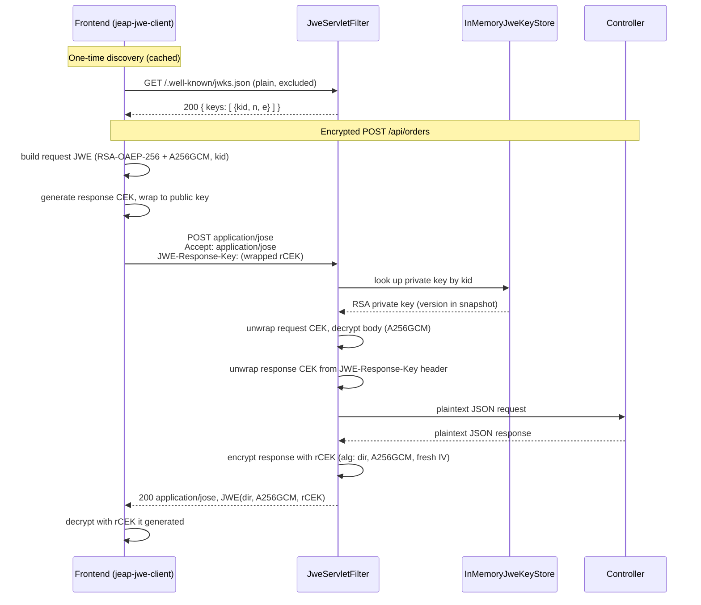
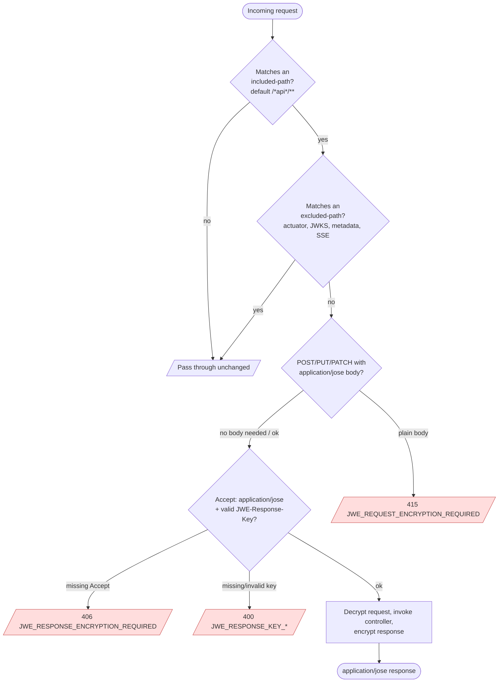
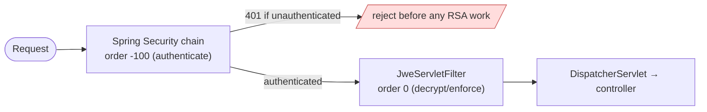

# Architecture

This page shows how the pieces of `jeap-spring-boot-jwe-starter` fit together end to end:
the **frontend** client, the **servlet filter** that transparently decrypts/encrypts, the
**key management** layer that keeps RSA key material in memory, and **Vault** (the KMS) that
backs that key material. It is the bird's-eye view; the per-topic pages linked throughout
go into detail.

The goal of the starter is **transparent JWE-based end-to-end encryption**: a browser talks
to the service over `application/jose` (compact JWE), while the application's controllers keep
working with plain JSON and never see any cryptography.

- **Key encryption:** `RSA-OAEP-256` (RSA-4096 key pairs)
- **Content encryption:** `A256GCM`
- **On the wire:** `application/jose` (compact JWE)
- **Libraries:** Nimbus JOSE+JWT on the server, [`jose`](https://github.com/panva/jose) on the
  client. **No custom cryptography.**
- **Crypto provider:**
  the [Amazon Corretto Crypto Provider](https://github.com/corretto/amazon-corretto-crypto-provider)
  (ACCP) is installed at top JCA priority to accelerate the RSA-OAEP and AES-GCM operations, with an
  automatic fallback to the JDK provider when the native library is unavailable on the platform.

## The big picture

Four cooperating parts: the browser frontend, the service's web layer (JWKS + metadata +
filter), the in-memory key store, and Vault's transit engine acting as the KMS. The key store
is the single source of truth shared by the JWKS endpoint and the filter.

The two interactions a client has with the service:

1. **Discovery (plain HTTP)** — fetch the public keys (JWKS) and the protocol metadata. These
   endpoints are always excluded from encryption so an unauthenticated client can bootstrap.
2. **Encrypted traffic (`application/jose`)** — every API request/response is a compact JWE.
   The filter decrypts inbound and encrypts outbound; controllers are untouched.

## Modules

The code is split into acyclic modules mirroring the `jeap-crypto` layout. Dependency
direction: `crypto ← key-management ← web ← starter`. Only `…-starter` is what an application
depends on.

| Module | Role in the architecture |
|--------|--------------------------|
| `…-jwe-crypto` | Pure JOSE/crypto: RSA key factory, 4096-bit validation, JWK Set conversion. No Spring. |
| `…-jwe-key-management` | `JweKeyStore` abstraction + `InMemoryJweKeyStore` cache, the static and Vault key sources, the loader and the refresher/scheduler. |
| `…-jwe-web` | Servlet layer: `JweJwksController`, `JweMetadataController`, `JweServletFilter`, path model (`JweFilterPaths`), `problem+json` writer. |
| `…-jwe-starter` | `@AutoConfiguration` + `JweProperties` (`jeap.jwe.*`); wires everything. |
| `…-jwe-test` | Shared 4096-bit RSA test keys (`JweTestKeys`), test scope only. |
| `…-jwe-security-it` | Integration tests proving coexistence with `jeap-spring-boot-security-starter`. |

See [README](../README.md) for the module table and the [AGENTS.md](../AGENTS.md) for the
detailed layout.

## Key management & the KMS

Vault's transit secret engine is the KMS of record; the service keeps a working copy of the
RSA key material **exclusively in JVM heap memory** — never on disk, in logs, or in external
caches. The `InMemoryJweKeyStore` holds an atomically-swapped, version-ordered snapshot:
the highest version is the *current* encryption key, and every version in the snapshot is
accepted for decryption (this is the rotation grace period). Keys are identified by a `kid` of
`<transit-key-name>:<version>`.

Two invariants this design guarantees:

- **Fail fast at startup.** If keys can't be loaded/validated, the application does not start —
  it never runs without usable encryption keys.
- **Survive a Vault outage at runtime.** A failed refresh never empties the store; the last good
  snapshot keeps serving the JWKS and decrypting requests until Vault recovers.

Rotation (`vault write -f transit/<system>/keys/<name>/rotate`) adds a version that appears at
the next refresh; old versions stay decryptable until evicted by `jeap.jwe.vault.min-key-version`.
Details: [Key management](key-management.md) · [Vault integration](vault-integration.md).

## Request/response flow through the filter

The `JweServletFilter` sits in the servlet chain (default order `0`, after Spring Security at
`-100`). It wraps the request so the `DispatcherServlet` and controllers see plaintext, and
wraps the response so the controller's JSON is encrypted on the way out. Request and response
use **separate** content-encryption keys (CEKs).

Key points reflected above:

- The client always supplies the **response** CEK in the `JWE-Response-Key` header (RSA-wrapped
  to the service's public key) — for GET *and* POST/PUT/PATCH. The request CEK is never reused
  for the response.
- The filter resolves the private key by the request's `kid`, accepting **any** active version
  in the store so a key rotated mid-flight still decrypts.
- Only successful (2xx) responses are encrypted. Errors are returned as plain
  `application/problem+json` (see below).

Full protocol with the GET variant and header contract: [Client integration](client-integration.md)
· [Servlet filter](servlet-filter.md).

## Filter decision: which requests are touched

Before any crypto, the filter decides whether a request is in scope using an **includes-then-
excludes** path model (matched against the application-relative path, with the context path
stripped). Out-of-scope requests pass through completely unchanged — no decryption, no
enforcement, no response encryption.

This is what lets a Self-Contained-System app (one Spring Boot server hosting both the REST API
and the SPA/static assets) encrypt only its API paths while serving the frontend shell in plain
HTTP. The effective include/exclude patterns are published on the metadata endpoint so a client
can mirror the same decision.

Every protocol failure is an RFC 7807 `application/problem+json` document with a stable,
machine-readable `code` (e.g. `JWE_UNKNOWN_KEY_ID` signals the client to refresh its JWKS).
The full table is in [Servlet filter](servlet-filter.md#mandatory-encryption--error-handling).

## Coexistence with jeap-security

Most jEAP services also run `jeap-spring-boot-security-starter`. The filters compose by order:
Spring Security authenticates at `-100`, the JWE filter decrypts at `0`.

Authenticating first limits unauthenticated decrypt amplification (each encrypted request costs
one RSA-4096 private-key operation). Two integration points: the **JWKS and metadata paths must be
reachable unauthenticated** (clients fetch keys before authenticating) — the starter contributes a
high-precedence `SecurityFilterChain` that permits exactly those two paths automatically when Spring
Security is present (opt out via `jeap.jwe.security.permit-well-known-endpoints=false`) — and a
**bearer-token JWE API should disable CSRF** like any stateless REST API. This is exercised end to
end by the `jeap-spring-boot-jwe-security-it` module. See
[Using with jeap-security](servlet-filter.md#using-with-jeap-security).

## Where to go next

| If you want to… | Read |
|-----------------|------|
| Wire the starter into a service | [Getting started](getting-started.md) |
| See every `jeap.jwe.*` property | [Configuration reference](configuration.md) |
| Understand the filter in depth | [Servlet filter](servlet-filter.md) |
| Build a non-Angular client | [Client integration](client-integration.md) |
| Understand key lifecycle | [Key management](key-management.md) |
| Configure Vault | [Vault integration](vault-integration.md) |
| Monitor it / verify E2E encryption | [Observability (metrics)](observability.md) |
| Run without Vault | [Testing without Vault](testing.md) |
