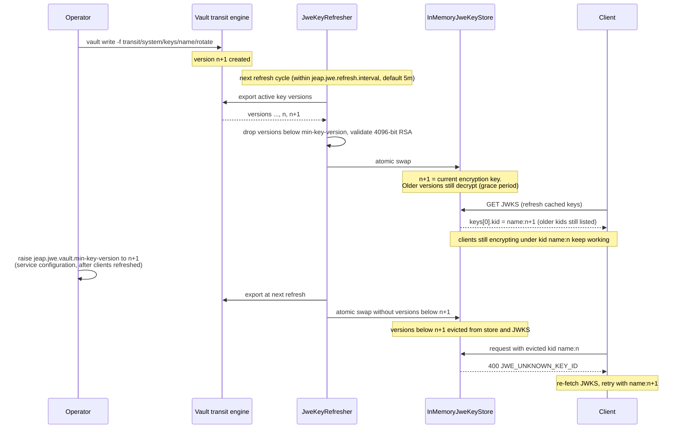

# Vault Integration

The starter uses **Spring Cloud Vault** (`VaultOperations`) to export RSA key material from
Vault's transit secret engine. It does not depend on `jeap-vault-starter`, but is compatible with it.

## Prerequisites

1. A Vault transit secret engine mounted at the configured path (e.g. `transit/my-system`).
2. An **exportable rsa-4096** transit key:
   ```bash
   vault write transit/<system>/keys/<key-name> type=rsa-4096 exportable=true
   ```
3. A Vault policy granting `read` and `update` on `transit/<system>/*`.
4. Spring Cloud Vault configured with connectivity and authentication
   (`spring.cloud.vault.*`).

## Secret-Engine Path

The path defaults to `transit/<jeap.vault.system-name>`. If `jeap.vault.system-name` is not
set, configure the path explicitly:

```yaml
jeap:
  jwe:
    vault:
      secret-engine-path: transit/my-system
```

## Authentication

The starter relies on whichever Spring Cloud Vault authentication method is configured
(typically AppRole, IAM etc. for production, Token for local development):

```yaml
spring:
  cloud:
    vault:
      authentication: APPROLE
      app-role:
        role-id: ${VAULT_ROLE_ID}
        secret-id: ${VAULT_SECRET_ID}
```

## Key Export

On each load/refresh, the starter calls the Vault transit export endpoint for the "encryption"
key type. Vault returns all active key versions. The starter then:

1. Filters out versions below `jeap.jwe.vault.min-key-version`.
2. Parses each PEM-encoded private key.
3. Validates the key is 4096-bit RSA.
4. Assigns a `kid` of `<key-name>:<version>`.

## Key Rotation

To rotate keys in Vault:

```bash
vault write -f transit/<system>/keys/<key-name>/rotate
```

The new version is picked up at the next refresh interval. Previous versions remain active
(for decryption) until evicted by `jeap.jwe.vault.min-key-version`.

The full rotation lifecycle — from the Vault rotation through the grace period to the
deliberate decommissioning of old versions:



When and how fast to rotate, and how long to wait before raising `min-key-version`, is covered
in the [key-rotation recommendations](security-considerations.md#key-rotation-recommendations).

## Outage Behavior

- **Startup**: If Vault is unreachable, the application **fails to start** (fail-fast).
- **Runtime**: If a refresh fails, the starter retries with exponential backoff. If all
  retries fail, the cached keys remain in use. See [key-management.md](key-management.md)
  for retry configuration.

## Disabling Vault

Set `spring.cloud.vault.enabled=false` to disable Vault entirely. In that case, the starter
requires static test keys (see [testing.md](testing.md)).

## Related

- [Getting started](getting-started.md)
- [Configuration reference](configuration.md)
- [Key management](key-management.md)
- [Security considerations](security-considerations.md)
- [Troubleshooting](troubleshooting.md)
